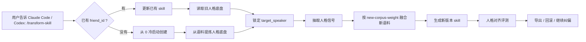

<div align="center">

# transform-skill

> “蒸馏过的朋友突然分手，性情大变？”<br>
> “兄弟的口头禅又变了，但他骨子里还是那个人吧？”<br>
> “新聊天记录来了，想更新 skill，又怕一脚把原人格踹飞？”

[中文版](./README.md) · [English](./readme_EN.md) · [日本語](./readme_JP.md)

[](https://claude.ai/code)
[](https://openai.com/)
[](#更新优先是主路线)
[](#蒸馏的是人格不是复读聊天记录)

</div>

## 这是什么

`transform-skill` 是一个面向 Claude Code / Codex / OpenSkills 生态的朋友人格 skill 工具。

它的重点不是把聊天记录变成一个“原句复读机”，而是从语料里提炼一个人的人格结构，再让这个人格随着新语料稳定更新。

它默认做这件事：**更新已有 skill，同时保住原人格的底盘**。

冷启动从 0 蒸馏也支持，但它是可选分支，不是主卖点。

## 蒸馏的是人格，不是复读聊天记录

聊天记录里有很多东西不该被当成人格：临时梗、当天情绪、群友名字、无意义复读、上下文残片、甚至“疯狂星期四”这种宇宙射线。

`transform-skill` 更关心的是这些稳定信号：

| 人格层 | 它会提炼什么 | 不会鼓励什么 |
|---|---|---|
| 价值观与边界 | 这个人通常在意什么，什么事会让他不爽，哪些边界不能踩 | 把某一句气话当永久信条 |
| 判断方式 | 他怎么权衡成本、风险、关系、行动顺序 | 只复刻某条聊天的答案 |
| 对话动作 | 他什么时候安慰、吐槽、追问、拒绝、推进下一步 | 一律输出模板化建议 |
| 表达 DNA | 长短句节奏、语气强弱、吐槽密度、口头禅使用习惯 | 把口头禅撒成调料包雨 |
| 兴趣与习惯 | 常聊领域、生活习惯、技术偏好、社交模式 | 看到关键词就乱编事实 |
| 上下文连续性 | 在群聊中接住当前话题和目标说话人的立场 | 把别人的说法混到目标人格里 |

一句话：它不是问“原文下一句是什么”，而是问“如果这个人此刻在场，他大概率会怎么想、怎么接、怎么说”。

## 它适合什么场景

| 你遇到的问题 | transform-skill 的处理方式 |
|---|---|
| 朋友最近分手了，说话锋利度变了 | 用新语料更新，但用低到中等权重保住旧人格 |
| 兄弟最近多了几个新口头禅 | 吸收表达变化，但避免口头禅过量表演 |
| 群聊导出里有很多人 | 用 `target_speaker` 锁定目标对象，不串人 |
| 新语料和旧人格有冲突 | 先保人格核心，再按 `new-corpus-weight` 控制融合力度 |
| 蒸馏结果越来越像客服 | 用人格对齐评测检查价值观、判断方式和对话动作 |
| 更新后跑偏了 | 用 `history` 和 `rollback` 回到旧版本 |

## 工作流一眼看懂



## 一分钟快速开始

### 1. 安装 skill

Claude Code：

```bash
npx skills add Xuan-0929/transform-skill --skill transform-skill -a claude-code -y
```

Codex：

```bash
npx skills add Xuan-0929/transform-skill --skill transform-skill -a codex -y
```

### 2. 准备语料路径

语料可以放在任意目录。只要 Claude Code 或 Codex 能读到，你把路径告诉它就行。

推荐结构只是为了不乱：

```bash
mkdir -p corpus/bootstrap corpus/incoming
```

推荐放法：

| 用途 | 推荐路径 | 说明 |
|---|---|---|
| 从 0 创建人格 | `./corpus/bootstrap/<your_seed_corpus>.json` | 第一批相对稳定的聊天记录 |
| 更新已有人格 | `./corpus/incoming/<your_new_corpus>.json` | 新补充语料 |
| 多批语料 | `./corpus/incoming/` | 可以告诉 skill 读取整个目录 |

支持 JSON 文件和包含 JSON 的目录。真实聊天记录里通常有多人，所以一定要知道目标说话人的标签，也就是 `target_speaker`。

### 3. 在 Claude Code 里怎么说

更新已有 skill，也就是默认路线：

```text
/transform-skill
帮我更新 friend_id=<你的朋友ID>。
新语料在 <你的新语料路径>，
目标说话人是 <语料里的目标用户名>，
新语料权重用 0.2。
```

从 0 冷启动创建：

```text
/transform-skill
新建一个 friend_id=<你的朋友ID>，
语料在 <你的初始语料路径>，
目标说话人是 <语料里的目标用户名>。
```

查看历史并回滚：

```text
/transform-skill
查看 friend_id=<你的朋友ID> 的历史版本，
如果最新版本跑偏了，就回滚到我指定的版本。
```

### 4. 在 Codex 里怎么说

Codex 没有 slash 入口时，直接用自然语言指名 skill：

```text
请使用 transform-skill 更新 friend_id=<你的朋友ID>。
新语料路径是 <你的新语料路径>，
target_speaker=<语料里的目标用户名>，
new-corpus-weight=0.2。
更新后导出为可安装的 skill。
```

## 更新优先是主路线

默认策略是：**先保人格，再吃新语料**。

`new-corpus-weight` 可以理解成“新语料说了算的程度”：

| 权重 | 适合情况 | 效果 |
|---:|---|---|
| `0.10 - 0.30` | 新语料只是近期变化 | 保守更新，旧人格很稳 |
| `0.40 - 0.60` | 最近确实有明显变化 | 平衡融合，新旧都看 |
| `0.70 - 1.00` | 目标对象真的变很多 | 激进更新，更相信新语料 |

如果你只是想更新一点新口癖、新兴趣、新近况，建议从 `0.2` 开始。别一上来拉满，除非这个朋友真的像换了个灵魂补丁。

## 多人聊天记录怎么避免串人

真实语料通常像群聊火锅：A 在吐槽，B 在接梗，C 在发癫，D 在发链接。

所以需要两个字段：

| 字段 | 作用 |
|---|---|
| `friend_id` | 你给这个人格起的稳定 ID，后续更新一直用同一个 |
| `target_speaker` | 语料里目标对象的真实说话人标签 |

示例：

```text
friend_id=<你的朋友ID>
target_speaker=<聊天记录里的目标说话人标签>
```

不要用示例名硬套。打开你的 JSON，看看 `speaker`、`sender`、`name` 或类似字段里目标对象到底叫什么，就填那个。

## 产物长什么样

一次成功运行后，会得到一个可版本化的人格 skill，包括：

| 产物 | 用途 |
|---|---|
| `profile` | 人格核心、表达风格、习惯、决策规则 |
| `versions` | 每次创建或更新都会生成新版本 |
| `exports.agentskills` | 面向 Claude Code / OpenSkills 的 skill 导出 |
| `exports.codex` | 面向 Codex 的 skill 导出 |
| `history` | 查看版本变化 |
| `rollback` | 更新失败时回滚 |
| `correction` | 追加纠偏说明，让下一版更稳 |

## 怎么判断蒸馏质量

不要只看“和原聊天下一句一不一样”。那会把项目带成背诵机。

更合理的验收方式是看人格对齐：

| 评测维度 | 看什么 |
|---|---|
| 价值与立场 | 是否延续这个人的判断底层，而不是突然变客服 |
| 对话动作 | 该吐槽时吐槽，该安慰时安慰，该追问时追问 |
| 上下文连续性 | 是否接住当前话题和群聊里的目标说话人立场 |
| 表达自然度 | 是否像真人自然接话，而不是报告格式 |
| 口头禅克制 | 有个人味，但不把口头禅刷屏 |
| 鲁棒性 | 不因为一句梗、一条脏数据、一个别人名字就跑偏 |

项目内置的 holdout 评测支持人格对齐 judge。它关注的是“这个人会不会这么想、这么接”，不是“有没有一字不差复刻”。

## 和普通 prompt 模板有什么区别

普通 prompt 模板常见问题：

| 普通模板 | transform-skill |
|---|---|
| 写几条人设规则 | 从语料抽取稳定人格信号 |
| 容易一问就客服化 | 强制保持对话动作和表达 DNA |
| 新语料容易覆盖旧人设 | 用权重和版本控制做稳定更新 |
| 多人群聊容易串味 | 用 `target_speaker` 锁定对象 |
| 只看风格像不像 | 同时看价值观、判断方式、上下文连续性 |

## 常用对话指令

```text
/transform-skill
更新 friend_id=<朋友ID>，语料=<路径>，target_speaker=<目标说话人>，new-corpus-weight=0.2。
```

```text
/transform-skill
新建 friend_id=<朋友ID>，语料=<路径>，target_speaker=<目标说话人>。
```

```text
/transform-skill
查看 friend_id=<朋友ID> 的版本历史。
```

```text
/transform-skill
把 friend_id=<朋友ID> 回滚到 <版本号>。
```

```text
/transform-skill
给 friend_id=<朋友ID> 追加纠偏：不要把口头禅用太多，要优先保持判断方式和人格底层。
```

## 多 Host 安装与运维

详细安装、手动挂载、OpenClaw、目录结构和故障排查见 [INSTALL.md](./INSTALL.md)。

支持：

- OpenSkills 安装到 Claude Code
- OpenSkills 安装到 Codex
- Claude Code 手动挂载
- OpenClaw 手动挂载
- 本地版本查看、回滚、导出、诊断

## FAQ

### Q1: 这是从 0 蒸馏项目吗？

可以从 0 蒸馏，但主路线是更新已有 skill。它更像人格版本管理器，不是一次性炼丹炉。

### Q2: 它会不会只学口头禅？

不会只看口头禅。口头禅只是表达 DNA 的一小部分，权重低于价值观、判断方式、上下文连续性和对话动作。

### Q3: 为什么不追求原句 100% 相似？

因为那会过拟合。真正有用的朋友人格不是复读某一句话，而是在新场景里仍然像这个人。

### Q4: 我不知道 target_speaker 怎么填怎么办？

打开语料文件，找到目标对象在聊天记录中的说话人字段。它可能叫 `speaker`、`sender`、`name`、`nickname` 或类似名字。填里面的准确值。

### Q5: 更新跑偏了怎么办？

先用 `history` 看版本，再 `rollback` 回到旧版本。然后用更低的 `new-corpus-weight` 重新更新，必要时追加 correction。

## 一句话版

`transform-skill` 不是让 AI 背下朋友说过什么，而是让它学会：这个人为什么这么想，通常怎么判断，关系里怎么拿捏，最后才是怎么说出口。
