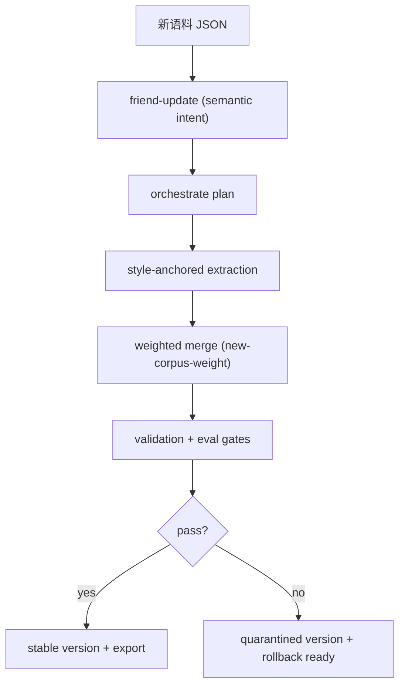

<div align="center">

# transform-skill

> "蒸馏过的朋友突然分手，性情大变？"  
> "兄弟的口头禅又变了，想更新 skill？"

[中文版入口](./README.md) · [English](./readme_EN.md) · [日本語](./readme_JP.md)

[](https://github.com/Xuan-0929/transform-skill/stargazers)
[](https://github.com/Xuan-0929/transform-skill/commits/main)
[](https://claude.ai/code)
[](https://openai.com/)
[](#更新优先策略)

</div>

---

## 这项目是干啥的

`transform-skill` 是一个 **skill 生态** 项目，不是本地小脚本拼盘。

它专门解决两件事：
1. 从 JSON 语料冷启动蒸馏一个“朋友型”人格（可选）。
2. 用新语料持续更新已有 skill，同时保留旧风格（主路径）。

一句话：**先有记忆，再做进化，不让新语料一脚把老人格踹飞。**

---

## 快速导航

- [30 秒快速开始](#30-秒快速开始)
- [用户语义命令层](#用户语义命令层)
- [更新优先策略](#更新优先策略)
- [多 Host 安装](#多-host-安装)
- [运维与验收](#运维与验收)
- [工程结构](#工程结构)

---

## 30 秒快速开始

### 1) 一键装载 skill（推荐）

```bash
# Claude Code
npx skills add Xuan-0929/transform-skill --skill distill-from-corpus-path -a claude-code -y

# Codex
npx skills add Xuan-0929/transform-skill --skill distill-from-corpus-path -a codex -y
```

### 2) 准备语料目录

```bash
mkdir -p corpus/bootstrap corpus/incoming
```

### 3) 在 Claude Code / Codex 里直接说（推荐）

更新已有朋友 skill：

```text
请使用 distill-from-corpus-path，执行 friend-update：
语料 ./corpus/incoming/week3.json，persona=laojin，新语料权重 0.2，导出 agentskills 和 codex。
```

冷启动（可选）：

```text
请使用 distill-from-corpus-path，执行 friend-create：
语料 ./corpus/bootstrap/friend_seed.json，persona=laojin，导出 agentskills 和 codex。
```

---

## 用户语义命令层

这次重点改动：不再让使用者先理解工程命令 `distill orchestrate/run`，而是先用语义命令。

| 语义命令 | 作用 | 是否需要 LLM |
|---|---|---|
| `friend-create` | 冷启动创建朋友 skill | 是 |
| `friend-update` | 用新语料更新已有 skill | 是 |
| `friend-list` | 列出现有朋友 skill | 否 |
| `friend-history` | 看版本和审计历史 | 否 |
| `friend-rollback` | 回滚到指定版本 | 否 |
| `friend-export` | 导出到 agentskills/codex | 否 |
| `friend-correct` | 追加纠偏说明（Correction 层） | 否 |
| `friend-doctor` | 输出运行时诊断信息 | 否 |

维护脚本入口：

```bash
./skills/distill-from-corpus-path/scripts/run_friend_command.sh <intent> [corpus_path] [persona_id]
```

示例：

```bash
./skills/distill-from-corpus-path/scripts/run_friend_command.sh friend-list
./skills/distill-from-corpus-path/scripts/run_friend_command.sh friend-history "" laojin
DISTILL_TO_VERSION=v0003 ./skills/distill-from-corpus-path/scripts/run_friend_command.sh friend-rollback "" laojin
```

---

## 更新优先策略

### 权重参考

| `new-corpus-weight` | 适合场景 | 结果倾向 |
|---|---|---|
| `0.10 - 0.30` | 轻微改口头禅/语气 | 强保留旧人格 |
| `0.40 - 0.60` | 正常迭代 | 新旧平衡 |
| `0.70 - 1.00` | 阶段性变化 | 快速吸收新特征 |

### 这次核心升级

- 冷启动抽取提示词特化为 **friend object model**。
- 更新阶段注入已有 skill 的 **style anchors**（表达片段 + 签名词汇）。
- 再叠加 `new-corpus-weight` 融合，三层一起避免人格漂移。

---

## 多 Host 安装

完整手册见 [INSTALL.md](./INSTALL.md)。

支持路径：
- OpenSkills 一键安装（Claude Code / Codex）
- Claude Code 手动挂载（项目级 / 全局）
- OpenClaw 手动挂载

---

## 运行依赖策略

对齐同事/前任 skill 的思路：**可选依赖、按需校验、分层执行**。

- Python 依赖安装是可选但推荐：

```bash
pip3 install -r skills/distill-from-corpus-path/runtime/requirements.txt
```

- `friend-list/history/rollback/export/correct` 不依赖 LLM，可离线执行。
- `friend-create/update` 才要求本机 `claude` CLI 可用。
- 自动依赖自举默认关闭，需要时再开：

```bash
DISTILL_AUTO_BOOTSTRAP=1
```

---

## 运维与验收

一次成功更新建议看这些字段：

- `semantic_intent`
- `workflow_mode`（应为 `agent-led-script-exec`）
- `plan.mode`（`update` 或 `cold_start`）
- `version`
- `status`（`stable` / `quarantined`）
- `export.exports.agentskills`
- `export.exports.codex`

---

## 核心流程图



---

## 工程结构

```text
transform-skill/
├── README.md
├── readme_EN.md
├── readme_JP.md
├── INSTALL.md
├── skills/distill-from-corpus-path/
│   ├── SKILL.md
│   ├── runtime/src/persona_distill/
│   └── scripts/
│       ├── run_friend_command.sh
│       ├── run_agent_orchestrated.sh
│       └── run_distill_from_path.sh
├── src/persona_distill/
│   ├── semantic_commands.py
│   ├── extract.py
│   ├── workflow.py
│   └── cli.py
└── tests/
```

---

## 常见问题

### 我已经挂载 skill 了，为啥还有命令脚本

两类人都要照顾：
- 使用者：在会话里直接用自然语言触发。
- 维护者：需要可重复的命令入口做运维和验收。

### 为啥只支持 JSON

这是当前版本刻意边界。你这次要求是先把交互和生态打磨好，数据接入面暂不扩展。

### 还保留工程 CLI 吗

保留，但降级为维护入口。主入口是 `friend-*` 语义命令层。

