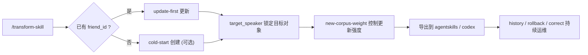

<div align="center">

# transform-skill

> “兄弟最近说话变味了，想让 skill 跟着更新？”  
> “新语料来了，但你不想把原来的人格全推翻？”

[中文版入口](./README.md) · [English](./readme_EN.md) · [日本語](./readme_JP.md)

[](https://claude.ai/code)
[](https://openai.com/)
[](#更新优先是主路线)

</div>

## 这是什么

`transform-skill` 是一个“更新优先”的 skill：

- 主卖点不是从 0 蒸馏，而是**给已有 skill 做稳定进化**。
- 新语料可以吸收，但人格不会轻易崩。
- 多人聊天语料可以锁定单一目标用户（`target_speaker`）。

## 你可以直接做什么

1. 给已有朋友人格追加新语料并控制更新强度。
2. 查看历史版本、回滚、导出、纠偏。
3. 需要时再做冷启动（可选分支，不是默认）。

## 典型场景

| 你遇到的问题 | 用 transform-skill 怎么做 |
|---|---|
| 朋友最近说话风格变了，但不能丢老味道 | `update` + 低到中等权重（`0.2~0.5`） |
| 群聊导出的语料里有很多人 | 固定 `target_speaker`，只蒸馏目标对象 |
| 更新后不满意，想回到上周版本 | `history` 查看版本，再 `rollback` |
| 想把当前人格给 Claude/Codex 都装上 | `export` 到 `agentskills + codex` |

## 体验流程图



## 一分钟启动

### 1) 安装主入口 skill（`transform-skill`）

```bash
# Claude Code
npx skills add Xuan-0929/transform-skill --skill transform-skill -a claude-code -y

# Codex
npx skills add Xuan-0929/transform-skill --skill transform-skill -a codex -y
```

### 2) 准备语料

```bash
mkdir -p corpus/bootstrap corpus/incoming
```

- 冷启动语料：`corpus/bootstrap/<seed_corpus>.json`
- 更新语料：`corpus/incoming/<new_corpus>.json`

### 3) 在会话里直接启动

Claude Code：

```text
/transform-skill
```

Codex：

```text
请使用 transform-skill，更新 friend_id=<friend_id>，
语料=./corpus/incoming/<new_corpus>.json，
target_speaker=<target_speaker>，new-corpus-weight=0.2。
```

## 三段对话上手

更新已有 skill（默认）：

```text
/transform-skill
帮我更新 friend_id=friend-alex。
语料在 ./corpus/incoming/week4.json，
目标说话人是 Alex，新语料权重 0.2。
```

冷启动（可选）：

```text
/transform-skill
新建一个 friend_id=friend-river，
语料 ./corpus/bootstrap/seed.json，
目标说话人 River。
```

运维（回滚示例）：

```text
/transform-skill
查看 friend_id=friend-alex 的历史版本，
并回滚到 v0003。
```

## 更新优先是主路线

默认策略：**先保人格，再吃新语料**。

`new-corpus-weight` 建议：

- `0.10 - 0.30`：保守更新，强保留旧风格
- `0.40 - 0.60`：平衡融合
- `0.70 - 1.00`：激进更新

## 多人语料怎么避免串人

如果语料有多个人，务必固定：

1. `friend_id`（同一个对象始终不变）
2. `target_speaker`（语料里目标用户的说话人标签）

例如：
- `friend_id=friend-alex`
- `target_speaker=Alex`

## 对话层动作（产品语义）

- 更新已有 skill（默认）
- 冷启动新 skill（可选）
- 查看列表 / 历史
- 回滚 / 导出
- 追加纠偏
- 运行时诊断

对应执行内核会映射到 `friend-*` 语义命令。

## 产物与验收

一次成功执行后，重点看这些字段：

- `semantic_intent`
- `persona`
- `version`
- `status`
- `workflow_mode`
- `export.exports.agentskills`
- `export.exports.codex`

## 兼容说明

- 新项目请走主入口：`transform-skill`
- 旧入口 `distill-from-corpus-path` 仍保留（兼容老调用链）

## 多 Host 与运维

详细安装与运维见 [INSTALL.md](./INSTALL.md)。

支持：
- OpenSkills（Claude Code / Codex）
- Claude Code 手动挂载
- OpenClaw 手动挂载

## FAQ

### Q1: 这是纯蒸馏项目吗？

不是。它的核心定位是“**已有人格的持续更新**”，冷启动只是可选能力。

### Q2: 为什么要 `target_speaker`？

因为真实聊天语料常有多人，不锁定目标会把不同人的语气揉在一起。

### Q3: 会不会越更越不像原来？

默认不会。更新强度由 `new-corpus-weight` 控制，低权重会更保守。
