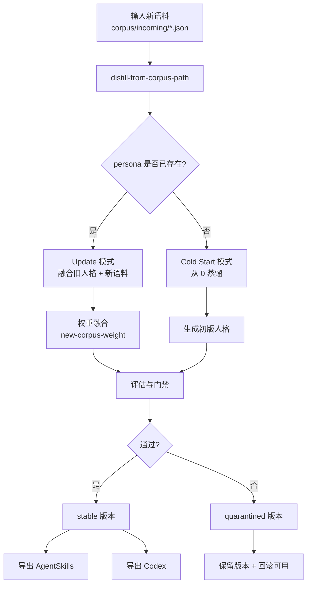

<div align="center">

# transform-skill

> "蒸馏过的人设突然分手，性情大变？\
> 新语料来了，又怕一更新就把老人格推翻？"

[中文版](./README.md) · [English](./readme_EN.md) · [日本語](./readme_JP.md)

<br/>

[](https://github.com/Xuan-0929/transform-skill/stargazers)
[](https://github.com/Xuan-0929/transform-skill/commits/main)
[](https://www.python.org/)

[](https://claude.ai/code)
[](https://openai.com/)
[](#更新优先策略)

</div>

---

## 这项目解决什么问题

> 👤 你的同事跳槽、搭档转组、朋友风格变化，旧人格开始失真？  
> 🧠 你已经有一个能用的 skill，但只想“增量进化”，不想“人格重建”？  
> ⚖️ 你希望新语料有影响力，但不能把老风格全部冲掉？

**`transform-skill` 的答案：更新优先（update-first）。**

- 主路径：给已有 skill 喂新语料，持续更新
- 可选路径：从 0 冷启动蒸馏
- 核心旋钮：`new-corpus-weight` 控制新语料权重

---

## 快速导航

- [30 秒快速启动](#30-秒快速启动)
- [核心工作流图](#核心工作流图)
- [更新优先策略](#更新优先策略)
- [产物输出与验收](#产物输出与验收)
- [常见问题](#常见问题)

---

## 30 秒快速启动

以下示例中的 `<...>` 都是占位符，请替换成你自己的真实值。

### 1) 安装并进入项目

```bash
git clone https://github.com/Xuan-0929/transform-skill.git
cd transform-skill
```

### 2) 放语料（推荐目录）

```bash
mkdir -p corpus/bootstrap corpus/incoming
```

- `corpus/bootstrap/`：第一次建档（冷启动）
- `corpus/incoming/`：后续新增语料（更新）

### 3) 登录 Claude 运行时（首次）

```bash
claude auth login
```

### 4) 直接在 Claude Code 里说（推荐入口）

```text
请使用 distill-from-corpus-path，把 ./corpus/incoming/<new-corpus-file>.json 更新到 persona=<your-persona-id>，新语料权重 0.2
```

可选（冷启动）：

```text
请使用 distill-from-corpus-path，用 ./corpus/bootstrap/<bootstrap-corpus-file>.json 冷启动 persona=<your-persona-id>
```

### 5) 或者直接跑命令（CLI 入口）

```bash
DISTILL_NEW_CORPUS_WEIGHT=0.2 \
./skills/distill-from-corpus-path/scripts/run_distill_from_path.sh \
./corpus/incoming/<new-corpus-file>.json \
<your-persona-id>
```

---

## 核心工作流图



---

## 更新优先策略

### 权重怎么选

| `new-corpus-weight` | 适合场景 | 结果倾向 |
|---|---|---|
| `0.10 - 0.30` | 只想微调口头禅/语气 | 强保留旧人格，变化温和 |
| `0.40 - 0.60` | 新语料增量明显 | 新旧平衡融合 |
| `0.70 - 1.00` | 人设确实阶段变化 | 快速吸收新特征 |

一句话：**越小越稳，越大越激进。**

### 为什么要 update-first，而不是每次重蒸馏

| 方式 | 你得到的好处 | 代价 |
|---|---|---|
| 更新已有 skill（推荐） | 连续人格、可控演化、可回滚 | 需要你调一次权重 |
| 每次从 0 重蒸馏 | 一步到位的全新版本 | 易丢历史风格、人格漂移更大 |

---

## 产物输出与验收

### 输出目录

- 版本技能：`.distill/personas/<persona>/versions/<version>/skill/`
- Agent Skills 导出：`.distill/personas/<persona>/exports/<version>/agentskills/`
- Codex 导出：`.distill/personas/<persona>/exports/<version>/codex/`

### 验收信号

- `status: stable`：通过门禁，可作为当前主版本
- `status: quarantined`：版本保留，但不建议替换稳定版本

---

## 项目结构

```text
transform-skill/
├── README.md
├── readme_CN.md
├── readme_EN.md
├── readme_JP.md
├── skills/
│   └── distill-from-corpus-path/
│       ├── SKILL.md
│       └── scripts/run_distill_from_path.sh
└── src/persona_distill/
    ├── cli.py
    ├── workflow.py
    └── providers/
```

---

## 常见问题

### 我已经挂在 Claude Code 上了，为什么还有命令行示例

两类用户：
- skill 使用者：直接自然语言触发
- 仓库维护者：需要脚本入口做调试与批量验证

你如果只使用 skill，可以完全忽略 Python 章节。

### 报 `Claude CLI is not logged in`

```bash
claude auth login
```

### 报 `Error: claude native binary not installed`

```bash
npm install -g @anthropic-ai/claude-code
node "$(npm root -g)/@anthropic-ai/claude-code/install.cjs"
```

### 不在仓库根目录，脚本找不到项目

```bash
export DISTILL_PROJECT_ROOT=/absolute/path/to/transform-skill
```

---

## 开发者模式（可选）

只在你要改代码时使用：

```bash
python -m venv .venv
source .venv/bin/activate
pip install -e .
PYTHONPATH=src python -m persona_distill doctor
```

---

## 一句话总结

**`transform-skill` 不是“每次重来”，而是“保留人格记忆的持续进化”。**
