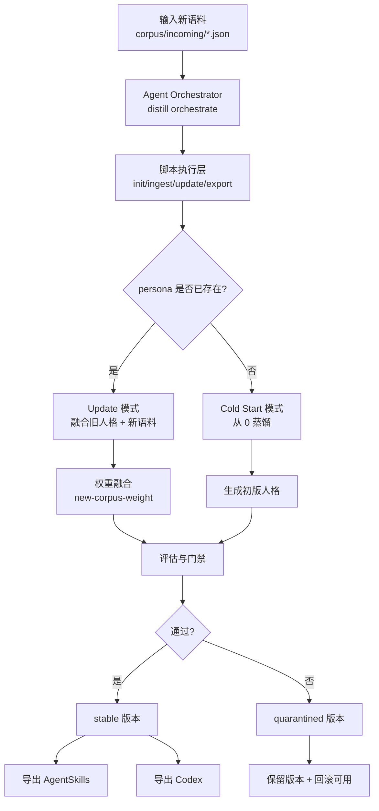

<div align="center">

# transform-skill

> "蒸馏过的人设突然分手，性情大变？\
> 新语料来了，又怕一更新就把老人格推翻？"

[中文版](./README.md) · [English](./readme_EN.md) · [日本語](./readme_JP.md)

<br/>

[](https://github.com/Xuan-0929/transform-skill/stargazers)
[](https://github.com/Xuan-0929/transform-skill/commits/main)
[](https://www.python.org/)

[](https://claude.ai/code)
[](https://openai.com/)
[](#更新优先策略)

</div>

---

## 这项目解决什么问题

> 👤 你的同事跳槽、搭档转组、朋友风格变化，旧人格开始失真？  
> 🧠 你已经有一个能用的 skill，但只想“增量进化”，不想“人格重建”？  
> ⚖️ 你希望新语料有影响力，但不能把老风格全部冲掉？

**`transform-skill` 的答案：更新优先（update-first）。**

- 主路径：给已有 skill 喂新语料，持续更新
- 可选路径：从 0 冷启动蒸馏
- 核心旋钮：`new-corpus-weight` 控制新语料权重

---

## 快速导航

- [OpenSkills 一键安装](#openskills-一键安装)
- [30 秒快速启动](#30-秒快速启动)
- [核心工作流图](#核心工作流图)
- [更新优先策略](#更新优先策略)
- [产物输出与验收](#产物输出与验收)
- [常见问题](#常见问题)

---

## OpenSkills 一键安装

先看可安装技能：

```bash
npx skills add Xuan-0929/transform-skill --list
```

安装到 Claude Code（推荐）：

```bash
npx skills add Xuan-0929/transform-skill \
  --skill distill-from-corpus-path \
  -a claude-code \
  -y
```

安装到 Codex：

```bash
npx skills add Xuan-0929/transform-skill \
  --skill distill-from-corpus-path \
  -a codex \
  -y
```

说明：
- 该 skill 已内置运行时（`runtime/src/persona_distill`），OpenSkills 安装后可直接运行
- 默认会自动自举 Python 依赖（可用 `DISTILL_AUTO_BOOTSTRAP=0` 关闭）
- 当前蒸馏引擎仍调用本机 `claude` CLI（即使从 Codex 触发，也需要先 `claude auth login`）

### 这仓库为什么能被 OpenSkills 一键安装

按照 `skills` CLI 的官方发现规则，这个仓库已经对齐为可发现、可安装、可执行三件事：

- 可发现：skill 放在 `skills/distill-from-corpus-path/SKILL.md`
- 可安装：`npx skills add <repo> --list` 能列出 `distill-from-corpus-path`
- 可执行：skill 内置 `runtime/src/persona_distill`，安装后不依赖仓库源码路径
- 可跨代理：脚本用相对路径定位 runtime，同时兼容 `DISTILL_PROJECT_ROOT` 覆盖

一句话：不是“只改了 README”，而是把安装链路和运行链路都打通了。

---

## 30 秒快速启动

这部分按 OpenSkills 生态来写：先装载 skill，再在 Claude Code / Codex 会话里直接发任务，不用手动跑 `init/ingest/build`。
以下 `<...>` 都是占位符，请替换成真实值。

### 1) 装载到你当前使用的 Agent（只做一次）

```bash
# Claude Code
npx skills add Xuan-0929/transform-skill --skill distill-from-corpus-path -a claude-code -y

# Codex
npx skills add Xuan-0929/transform-skill --skill distill-from-corpus-path -a codex -y
```

### 2) 确认已装载 + 登录运行时（只做一次）

```bash
npx skills ls -a claude-code
npx skills ls -a codex
claude auth login
```

### 3) 准备语料路径（推荐）

```bash
mkdir -p corpus/bootstrap corpus/incoming
```

- `corpus/incoming/<new-corpus-file>.json`：更新已有人格（推荐主路径）
- `corpus/bootstrap/<bootstrap-corpus-file>.json`：从 0 冷启动（可选）

### 4) 在 Claude Code / Codex 会话里直接下任务（推荐）

更新已有 skill：

```text
请使用 distill-from-corpus-path，把 ./corpus/incoming/<new-corpus-file>.json 更新到 persona=<your-persona-id>，新语料权重 0.2，并导出 agentskills 和 codex。
```

冷启动（可选）：

```text
请使用 distill-from-corpus-path，用 ./corpus/bootstrap/<bootstrap-corpus-file>.json 冷启动 persona=<your-persona-id>，并导出 agentskills 和 codex。
```

### 5) 看结果是否通过验收

你会拿到一段 JSON，重点看这些字段：

- `workflow_mode`（应为 `agent-led-script-exec`）
- `plan.mode`（`update` 或 `cold_start`）
- `version`
- `status`（`stable` / `quarantined`）
- `export.exports.agentskills`
- `export.exports.codex`

维护者调试入口（可选）：

```bash
DISTILL_NEW_CORPUS_WEIGHT=0.2 \
./skills/distill-from-corpus-path/scripts/run_agent_orchestrated.sh \
./corpus/incoming/<new-corpus-file>.json \
<your-persona-id>
```

---

## 核心工作流图



---

## 更新优先策略

### 权重怎么选

| `new-corpus-weight` | 适合场景 | 结果倾向 |
|---|---|---|
| `0.10 - 0.30` | 只想微调口头禅/语气 | 强保留旧人格，变化温和 |
| `0.40 - 0.60` | 新语料增量明显 | 新旧平衡融合 |
| `0.70 - 1.00` | 人设确实阶段变化 | 快速吸收新特征 |

一句话：**越小越稳，越大越激进。**

### 为什么要 update-first，而不是每次重蒸馏

| 方式 | 你得到的好处 | 代价 |
|---|---|---|
| 更新已有 skill（推荐） | 连续人格、可控演化、可回滚 | 需要你调一次权重 |
| 每次从 0 重蒸馏 | 一步到位的全新版本 | 易丢历史风格、人格漂移更大 |

---

## 产物输出与验收

### 输出目录

- 版本技能：`.distill/personas/<persona>/versions/<version>/skill/`
- Agent Skills 导出：`.distill/personas/<persona>/exports/<version>/agentskills/`
- Codex 导出：`.distill/personas/<persona>/exports/<version>/codex/`

### 验收信号

- `status: stable`：通过门禁，可作为当前主版本
- `status: quarantined`：版本保留，但不建议替换稳定版本

---

## 项目结构

```text
transform-skill/
├── README.md
├── readme_CN.md
├── readme_EN.md
├── readme_JP.md
├── skills/
│   └── distill-from-corpus-path/
│       ├── SKILL.md
│       ├── runtime/
│       │   ├── requirements.txt
│       │   └── src/persona_distill/
│       └── scripts/
│           ├── run_agent_orchestrated.sh
│           └── run_distill_from_path.sh
├── scripts/
│   └── sync_skill_runtime.sh
└── src/persona_distill/
    ├── cli.py
    ├── workflow.py
    └── providers/
```

---

## 常见问题

### 我已经挂在 Claude Code 上了，为什么还有命令行示例

两类用户：
- skill 使用者：直接自然语言触发
- 仓库维护者：需要脚本入口做调试与批量验证

你如果只使用 skill，可以完全忽略 Python 章节。

### 报 `Claude CLI is not logged in`

```bash
claude auth login
```

### 报 `Error: claude native binary not installed`

```bash
npm install -g @anthropic-ai/claude-code
node "$(npm root -g)/@anthropic-ai/claude-code/install.cjs"
```

### 不在仓库根目录，脚本找不到项目

```bash
export DISTILL_PROJECT_ROOT=/absolute/path/to/transform-skill
```

### OpenSkills 安装后怎么确认真的可用

```bash
# 仅检查技能是否可发现
npx skills add Xuan-0929/transform-skill --list

# 检查脚本入口是否存在（Claude Code）
ls ./.claude/skills/distill-from-corpus-path/scripts/

# 检查脚本入口是否存在（Codex）
ls ./.agents/skills/distill-from-corpus-path/scripts/
```

---

## 开发者模式（可选）

只在你要改代码时使用：

```bash
python -m venv .venv
source .venv/bin/activate
pip install -e .
PYTHONPATH=src python -m persona_distill doctor
```

---

## 一句话总结

**`transform-skill` 不是“每次重来”，而是“保留人格记忆的持续进化”。**
