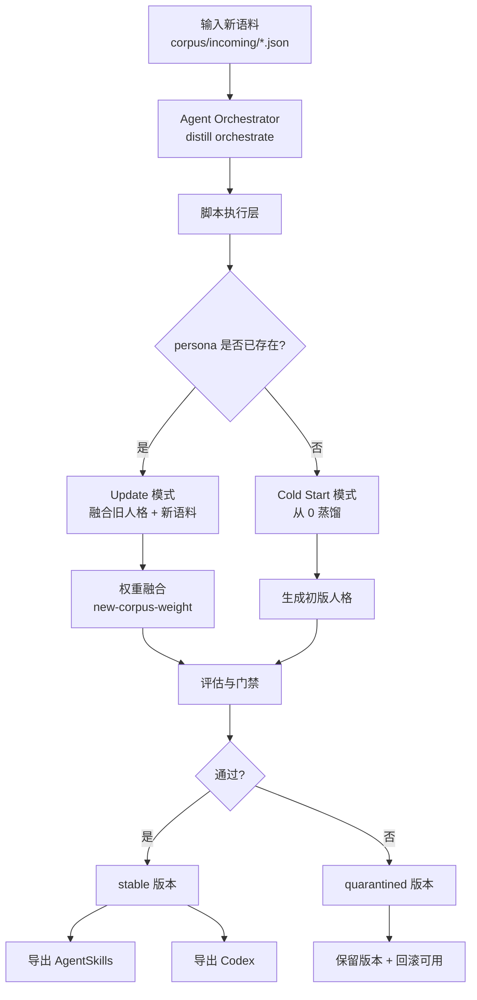

<div align="center">

# transform-skill（中文）

> 「蒸馏过的人设突然变味？\
> 新语料来了，又怕一更新就把老人格冲掉？」

[中文版入口](./README.md) · [English](./readme_EN.md) · [日本語](./readme_JP.md)

<br/>

[](https://github.com/Xuan-0929/transform-skill/stargazers)
[](https://github.com/Xuan-0929/transform-skill/commits/main)
[](https://www.python.org/)

[](https://claude.ai/code)
[](https://openai.com/)
[](#更新优先策略)

</div>

---

## OpenSkills 一键安装

先看可安装技能：

```bash
npx skills add Xuan-0929/transform-skill --list
```

安装到 Claude Code：

```bash
npx skills add Xuan-0929/transform-skill \
  --skill distill-from-corpus-path \
  -a claude-code \
  -y
```

安装到 Codex：

```bash
npx skills add Xuan-0929/transform-skill \
  --skill distill-from-corpus-path \
  -a codex \
  -y
```

说明：
- skill 内置运行时在 `skills/distill-from-corpus-path/runtime`
- 默认自动自举依赖（`DISTILL_AUTO_BOOTSTRAP=0` 可关闭）
- 蒸馏执行仍依赖本机 `claude` CLI（在 Codex 中触发也一样，需要先 `claude auth login`）

### OpenSkills 格式对齐说明

这个仓库不是“只有提示词”的壳子，而是完整可安装 skill 包：

- skill 入口：`skills/distill-from-corpus-path/SKILL.md`
- 安装发现：`npx skills add <repo> --list` 可列出技能
- 运行时同捆：`runtime/src/persona_distill` 随 skill 一起安装
- 脚本自定位：支持 `DISTILL_PROJECT_ROOT` / skill 目录双路径解析

---

## 30 秒快速启动

按 OpenSkills 习惯：先装载 skill，再在会话里直接发任务。以下 `<...>` 是占位符。

### 1) 装载到 Claude Code / Codex（只做一次）

```bash
# Claude Code
npx skills add Xuan-0929/transform-skill --skill distill-from-corpus-path -a claude-code -y

# Codex
npx skills add Xuan-0929/transform-skill --skill distill-from-corpus-path -a codex -y
```

### 2) 确认已装载并登录运行时

```bash
npx skills ls -a claude-code
npx skills ls -a codex
claude auth login
```

### 3) 准备语料路径

```bash
mkdir -p corpus/bootstrap corpus/incoming
```

- `corpus/incoming/<new-corpus-file>.json`：更新已有 persona
- `corpus/bootstrap/<bootstrap-corpus-file>.json`：从 0 冷启动

### 4) 在会话里直接下任务（推荐）

更新：

```text
请使用 distill-from-corpus-path，把 ./corpus/incoming/<new-corpus-file>.json 更新到 persona=<your-persona-id>，新语料权重 0.2，并导出 agentskills 和 codex。
```

冷启动（可选）：

```text
请使用 distill-from-corpus-path，用 ./corpus/bootstrap/<bootstrap-corpus-file>.json 冷启动 persona=<your-persona-id>，并导出 agentskills 和 codex。
```

### 5) 验收看这几个字段

- `workflow_mode`
- `plan.mode`
- `version`
- `status`
- `export.exports.agentskills`
- `export.exports.codex`

---

## 核心工作流图



---

## 更新优先策略

| `new-corpus-weight` | 适合场景 | 结果倾向 |
|---|---|---|
| `0.10 - 0.30` | 轻微微调 | 旧人格强保留 |
| `0.40 - 0.60` | 常规迭代 | 新旧平衡融合 |
| `0.70 - 1.00` | 阶段变化 | 快速吸收新特征 |

---

## 输出路径

- 版本技能：`.distill/personas/<persona>/versions/<version>/skill/`
- Agent Skills 导出：`.distill/personas/<persona>/exports/<version>/agentskills/`
- Codex 导出：`.distill/personas/<persona>/exports/<version>/codex/`

---

## 常见报错

- `Claude CLI is not logged in`
```bash
claude auth login
```

- `Error: claude native binary not installed`
```bash
npm install -g @anthropic-ai/claude-code
node "$(npm root -g)/@anthropic-ai/claude-code/install.cjs"
```

- 找不到运行时根目录
```bash
export DISTILL_PROJECT_ROOT=/absolute/path/to/transform-skill
```
