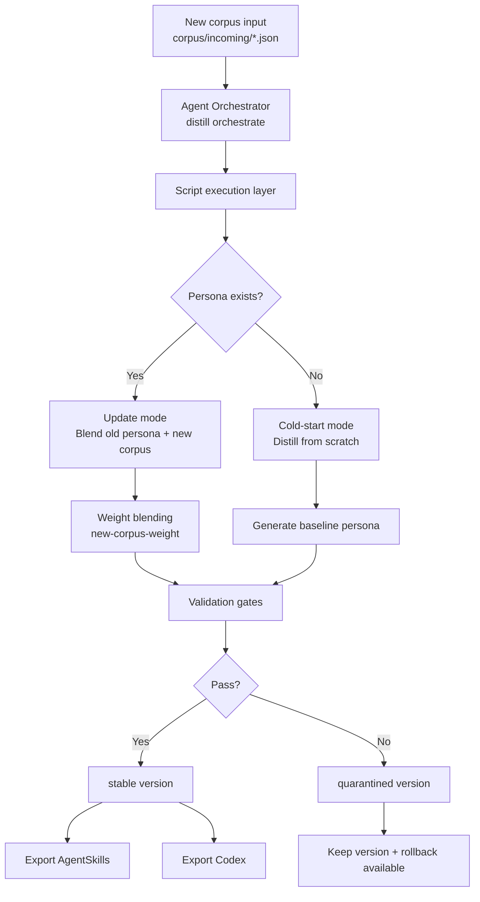

<div align="center">

# transform-skill

> "Your distilled persona changed overnight?\
> New corpus arrived, but you're afraid one update will overwrite the old voice?"

[中文版](./README.md) · [English](./readme_EN.md) · [日本語](./readme_JP.md)

<br/>

[](https://github.com/Xuan-0929/transform-skill/stargazers)
[](https://github.com/Xuan-0929/transform-skill/commits/main)
[](https://www.python.org/)

[](https://claude.ai/code)
[](https://openai.com/)
[](#update-first-strategy)

</div>

---

## OpenSkills One-Click Install

List installable skills:

```bash
npx skills add Xuan-0929/transform-skill --list
```

Install for Claude Code:

```bash
npx skills add Xuan-0929/transform-skill \
  --skill distill-from-corpus-path \
  -a claude-code \
  -y
```

Install for Codex:

```bash
npx skills add Xuan-0929/transform-skill \
  --skill distill-from-corpus-path \
  -a codex \
  -y
```

Notes:
- Bundled runtime is included under `skills/distill-from-corpus-path/runtime`
- Dependency auto-bootstrap is enabled by default (`DISTILL_AUTO_BOOTSTRAP=0` to disable)
- Distillation still runs through local `claude` CLI (even when invoked from Codex, run `claude auth login` first)

### OpenSkills Format Alignment

This repository is not just prompts; it is packaged as an installable skill:

- Skill entrypoint: `skills/distill-from-corpus-path/SKILL.md`
- Discovery-ready: `npx skills add <repo> --list` can find the skill
- Runtime bundled: `runtime/src/persona_distill` ships with the skill
- Script self-resolution: supports both `DISTILL_PROJECT_ROOT` and skill-local runtime paths

---

## 30-Second Quickstart

OpenSkills-style flow: install once, then trigger tasks by chat in Claude Code / Codex.
All `<...>` values are placeholders.

### 1) Install to your active agent (one-time)

```bash
# Claude Code
npx skills add Xuan-0929/transform-skill --skill distill-from-corpus-path -a claude-code -y

# Codex
npx skills add Xuan-0929/transform-skill --skill distill-from-corpus-path -a codex -y
```

### 2) Confirm installation + login runtime

```bash
npx skills ls -a claude-code
npx skills ls -a codex
claude auth login
```

### 3) Prepare corpus paths

```bash
mkdir -p corpus/bootstrap corpus/incoming
```

- `corpus/incoming/<new-corpus-file>.json`: update existing persona (recommended)
- `corpus/bootstrap/<bootstrap-corpus-file>.json`: cold-start from scratch (optional)

### 4) Send tasks directly in chat (recommended)

Update existing skill:

```text
Use distill-from-corpus-path to update persona=<your-persona-id> with ./corpus/incoming/<new-corpus-file>.json, new-corpus-weight=0.2, and export both agentskills and codex.
```

Cold-start (optional):

```text
Use distill-from-corpus-path to cold-start persona=<your-persona-id> from ./corpus/bootstrap/<bootstrap-corpus-file>.json, and export both agentskills and codex.
```

### 5) Verify acceptance fields

- `workflow_mode`
- `plan.mode`
- `version`
- `status`
- `export.exports.agentskills`
- `export.exports.codex`

---

## Core Workflow Diagram



---

## Weight Guide

| `new-corpus-weight` | Best for | Outcome tendency |
|---|---|---|
| `0.10 - 0.30` | light tuning | strong preservation of old persona |
| `0.40 - 0.60` | regular iteration | balanced blend |
| `0.70 - 1.00` | phase change | aggressive adoption of new traits |

---

## Output Paths

- Version skill: `.distill/personas/<persona>/versions/<version>/skill/`
- Agent Skills export: `.distill/personas/<persona>/exports/<version>/agentskills/`
- Codex export: `.distill/personas/<persona>/exports/<version>/codex/`

---

## Common Errors

- `Claude CLI is not logged in`
```bash
claude auth login
```

- `Error: claude native binary not installed`
```bash
npm install -g @anthropic-ai/claude-code
node "$(npm root -g)/@anthropic-ai/claude-code/install.cjs"
```

- Cannot locate runtime root
```bash
export DISTILL_PROJECT_ROOT=/absolute/path/to/transform-skill
```
