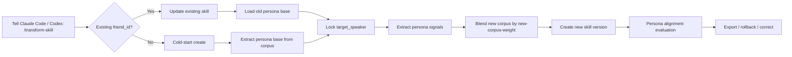

<div align="center">

# transform-skill

> "Your distilled friend just went through a breakup and the vibe shifted?"<br>
> "Your buddy picked up new catchphrases, but the core personality is still there, right?"<br>
> "New chat logs arrived, and you want the skill to evolve without nuking the old persona?"

[中文](./README.md) · [English](./readme_EN.md) · [日本語](./readme_JP.md)

[](https://claude.ai/code)
[](https://openai.com/)
[](#update-first-is-the-default-path)
[](#it-distills-persona-not-chat-log-replay)

</div>

## What This Is

`transform-skill` is a friend-persona skill workflow for Claude Code, Codex, and the OpenSkills ecosystem.

It does not try to turn chat logs into a quote-replay bot. It extracts a person's persona structure from corpus evidence, then lets that persona evolve safely when new corpus arrives.

Its default job is: **update an existing skill while preserving the original persona base**.

Cold-start distillation from zero is supported too, but it is an optional path, not the main selling point.

## It Distills Persona, Not Chat Log Replay

Chat logs contain plenty of things that should not become personality: temporary memes, one-day emotions, group member names, meaningless repetition, context fragments, and cosmic rays disguised as jokes.

`transform-skill` focuses on stable signals:

| Persona Layer | What It Extracts | What It Avoids |
|---|---|---|
| Values and boundaries | What the person cares about, what annoys them, what lines they do not like crossed | Treating one angry line as a permanent doctrine |
| Decision style | How they weigh cost, risk, relationships, and action order | Replaying one historical answer |
| Dialogue acts | When they comfort, tease, question, reject, or move things forward | Always producing template advice |
| Expression DNA | Sentence rhythm, tone intensity, sarcasm density, catchphrase habits | Sprinkling catchphrases like confetti |
| Interests and habits | Recurring topics, life habits, tech preferences, social patterns | Hallucinating facts from keywords |
| Context continuity | Staying on the live thread and the target speaker's stance | Mixing other speakers into the target persona |

In short: it does not ask "what was the next exact line?" It asks "if this person were here now, how would they likely think, respond, and phrase it?"

## When To Use It

| Situation | How transform-skill Handles It |
|---|---|
| A friend's tone changed after a major life event | Update with new corpus, but use low to medium weight to preserve the base |
| A buddy gained new catchphrases | Absorb expression drift without overusing catchphrases |
| The export is a group chat with many speakers | Lock `target_speaker` so personalities do not blend |
| New corpus conflicts with the old persona | Preserve persona core first, then blend by `new-corpus-weight` |
| Output starts sounding like customer support | Evaluate value stance, decision style, and dialogue acts |
| The latest update went sideways | Use `history` and `rollback` |

## Workflow At A Glance



## One-Minute Start

### 1. Install The Skill

Claude Code:

```bash
npx skills add Xuan-0929/transform-skill --skill transform-skill -a claude-code -y
```

Codex:

```bash
npx skills add Xuan-0929/transform-skill --skill transform-skill -a codex -y
```

### 2. Prepare Corpus Paths

Your corpus can live anywhere, as long as Claude Code or Codex can read it. Just give the path to the skill.

This folder layout is only a recommendation:

```bash
mkdir -p corpus/bootstrap corpus/incoming
```

Suggested layout:

| Purpose | Suggested Path | Notes |
|---|---|---|
| Create from zero | `./corpus/bootstrap/<your_seed_corpus>.json` | First stable corpus batch |
| Update existing persona | `./corpus/incoming/<your_new_corpus>.json` | New supplemental corpus |
| Multiple batches | `./corpus/incoming/` | You can point the skill at a directory |

JSON files and directories containing JSON files are supported. Real chat logs usually include multiple people, so you must know the target speaker label, also called `target_speaker`.

### 3. What To Type In Claude Code

Update an existing skill, the default path:

```text
/transform-skill
Update friend_id=<your_friend_id>.
The new corpus is at <your_new_corpus_path>.
The target speaker is <target_user_label_in_corpus>.
Use new-corpus-weight=0.2.
```

Cold-start from zero:

```text
/transform-skill
Create friend_id=<your_friend_id>.
The corpus is at <your_seed_corpus_path>.
The target speaker is <target_user_label_in_corpus>.
```

Show history and rollback:

```text
/transform-skill
Show version history for friend_id=<your_friend_id>.
If the latest version drifted, roll back to the version I choose.
```

### 4. What To Type In Codex

If there is no slash entry, name the skill in plain language:

```text
Please use transform-skill to update friend_id=<your_friend_id>.
The new corpus path is <your_new_corpus_path>.
target_speaker=<target_user_label_in_corpus>.
new-corpus-weight=0.2.
Export the updated persona as an installable skill.
```

## Update-First Is The Default Path

Default strategy: **preserve the persona first, then absorb new corpus**.

`new-corpus-weight` means how much authority the new corpus gets:

| Weight | Best For | Effect |
|---:|---|---|
| `0.10 - 0.30` | Recent but mild changes | Conservative update, strong old-persona retention |
| `0.40 - 0.60` | Clear recent changes | Balanced blend |
| `0.70 - 1.00` | The person really changed a lot | Aggressive adaptation |

If you only want to add new catchphrases, interests, or recent context, start around `0.2`. Do not max it out unless your friend truly installed a new soul patch.

## Avoiding Speaker Mix In Group Chats

Real chat logs are group-chat hot pot: one person vents, another jokes, someone posts links, someone goes feral.

You need two fields:

| Field | Purpose |
|---|---|
| `friend_id` | Stable ID you assign to this persona |
| `target_speaker` | Exact speaker label in the corpus |

Example shape:

```text
friend_id=<your_friend_id>
target_speaker=<exact_speaker_label_in_chat_log>
```

Do not copy placeholder names. Open your JSON and check fields like `speaker`, `sender`, `name`, or `nickname`, then use the exact value for the target person.

## What It Produces

A successful run creates a versioned persona skill:

| Output | Purpose |
|---|---|
| `profile` | Persona core, expression style, habits, and decision rules |
| `versions` | A new version for every create or update run |
| `exports.agentskills` | Skill export for Claude Code / OpenSkills |
| `exports.codex` | Skill export for Codex |
| `history` | Version history |
| `rollback` | Recovery when an update goes wrong |
| `correction` | Extra guidance for the next update |

## How To Judge Quality

Do not only ask whether the generated reply exactly matches the next line in the old chat. That turns the system into a memorizer.

Better acceptance checks focus on persona alignment:

| Dimension | What To Check |
|---|---|
| Values and stance | Does it preserve the person's underlying judgment instead of becoming generic support? |
| Dialogue act | Does it tease, comfort, question, reject, or move forward at the right moment? |
| Context continuity | Does it stay on the current thread and target speaker stance? |
| Natural expression | Does it sound like chat, not a report? |
| Catchphrase restraint | Does it have flavor without catchphrase spam? |
| Robustness | Does it resist random memes, dirty data, and other-speaker names? |

The built-in holdout evaluation supports a persona-alignment judge. It rewards "would this person think and respond this way?" rather than exact wording reuse.

## How It Differs From A Prompt Template

| Prompt Template | transform-skill |
|---|---|
| Manually writes a few persona rules | Extracts stable persona signals from corpus |
| Easily collapses into assistant tone | Preserves dialogue acts and expression DNA |
| New corpus may overwrite old persona | Uses weights and versioning for stable updates |
| Group chats can blend speakers | Locks the target via `target_speaker` |
| Mostly checks style | Also checks values, decisions, and context continuity |

## Common Conversation Commands

```text
/transform-skill
Update friend_id=<friend_id>, corpus=<path>, target_speaker=<target_speaker>, new-corpus-weight=0.2.
```

```text
/transform-skill
Create friend_id=<friend_id>, corpus=<path>, target_speaker=<target_speaker>.
```

```text
/transform-skill
Show version history for friend_id=<friend_id>.
```

```text
/transform-skill
Roll friend_id=<friend_id> back to <version>.
```

```text
/transform-skill
Add a correction for friend_id=<friend_id>: do not overuse catchphrases; preserve decision style and persona core first.
```

## Multi-Host Install And Operations

See [INSTALL.md](./INSTALL.md) for manual mounting, OpenClaw notes, directory layout, and troubleshooting.

Supported:

- OpenSkills install for Claude Code
- OpenSkills install for Codex
- Manual Claude Code mount
- Manual OpenClaw mount
- Local version history, rollback, export, and doctor flows

## FAQ

### Q1: Is this a from-zero distillation project?

It can distill from zero, but the main path is updating an existing skill. Think of it as persona version control, not a one-shot alchemy pot.

### Q2: Will it only learn catchphrases?

No. Catchphrases are only a small part of expression DNA. They rank below values, decision style, context continuity, and dialogue acts.

### Q3: Why not optimize for 100% exact reply similarity?

Because that overfits. A useful friend persona should remain recognizable in new situations, not memorize one old sentence.

### Q4: What if I do not know `target_speaker`?

Open your corpus file and find the target person's speaker field. It may be named `speaker`, `sender`, `name`, `nickname`, or something similar. Use the exact value.

### Q5: What if an update goes wrong?

Use `history`, then `rollback`. Retry with a lower `new-corpus-weight`, and add a correction note if needed.

## One-Line Version

`transform-skill` does not teach AI to recite what your friend once said. It teaches the skill why that person thinks that way, how they judge things, how they handle relationships, and only then how they phrase the reply.
