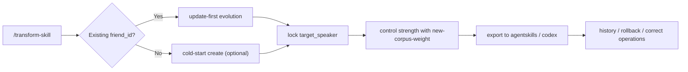

<div align="center">

# transform-skill

> "Your friend's tone drifted, but you don't want to lose their core vibe?"  
> "New corpus arrived, and you need controlled evolution instead of personality reset?"

[中文](./README.md) · [English](./readme_EN.md) · [日本語](./readme_JP.md)

[](https://claude.ai/code)
[](https://openai.com/)
[](#update-first-is-the-default)

</div>

## What This Is

`transform-skill` is an update-first skill:

- The core value is not one-shot distillation from zero.
- The core value is **stable evolution of an existing persona skill**.
- New corpus is absorbed without blindly wiping old personality anchors.
- Multi-speaker corpus is supported via `target_speaker`.

## What You Can Do

1. Add new corpus to an existing friend persona with controllable impact.
2. View history, rollback, export, and add correction notes.
3. Run cold-start only when you really need a brand-new persona.

## Typical Scenarios

| Your situation | Recommended move in transform-skill |
|---|---|
| Style has changed a bit, but old personality must stay | `update` + conservative weight (`0.2~0.5`) |
| Group chat corpus includes many people | lock `target_speaker` to one person |
| Latest update feels off | inspect `history`, then `rollback` |
| Need to ship to both Claude and Codex consumers | `export` to `agentskills + codex` |

## Experience Flow



## One-Minute Start

### 1) Install primary skill entry (`transform-skill`)

```bash
# Claude Code
npx skills add Xuan-0929/transform-skill --skill transform-skill -a claude-code -y

# Codex
npx skills add Xuan-0929/transform-skill --skill transform-skill -a codex -y
```

### 2) Prepare corpus folders

```bash
mkdir -p corpus/bootstrap corpus/incoming
```

- Cold-start corpus: `corpus/bootstrap/<seed_corpus>.json`
- Update corpus: `corpus/incoming/<new_corpus>.json`

### 3) Launch in session

Claude Code:

```text
/transform-skill
```

Codex:

```text
Use transform-skill to update friend_id=<friend_id>.
Input=./corpus/incoming/<new_corpus>.json,
target_speaker=<target_speaker>, new-corpus-weight=0.2.
```

## Three Quick Dialogue Patterns

Update existing skill (default):

```text
/transform-skill
Update friend_id=friend-alex.
Input is ./corpus/incoming/week4.json,
target speaker is Alex, weight is 0.2.
```

Cold-start (optional):

```text
/transform-skill
Create a new friend_id=friend-river.
Input is ./corpus/bootstrap/seed.json,
target speaker is River.
```

Ops (rollback example):

```text
/transform-skill
Show history for friend_id=friend-alex,
then rollback to v0003.
```

## Update-First Is The Default

Default strategy: **preserve personality anchors first, then absorb new corpus**.

`new-corpus-weight` guideline:

- `0.10 - 0.30`: conservative update, strong retention
- `0.40 - 0.60`: balanced blend
- `0.70 - 1.00`: aggressive adaptation

## Multi-Speaker Corpus Safety

Always lock these two fields:

1. `friend_id` (stable identity)
2. `target_speaker` (the exact speaker label in corpus)

Example:
- `friend_id=friend-alex`
- `target_speaker=Alex`

## Product-Level Actions

- update existing skill (default)
- cold-start new skill (optional)
- list / history
- rollback / export
- correction note
- runtime doctor

The execution layer maps them to `friend-*` semantic intents.

## Output & Acceptance Signals

After each successful run, check:

- `semantic_intent`
- `persona`
- `version`
- `status`
- `workflow_mode`
- `export.exports.agentskills`
- `export.exports.codex`

## Compatibility

- New usage: `transform-skill`
- Legacy entry still works: `distill-from-corpus-path`

## Multi-Host & Operations

See [INSTALL.md](./INSTALL.md) for full installation and operations details.

Supported:
- OpenSkills (Claude Code / Codex)
- Claude Code manual mount
- OpenClaw manual mount

## FAQ

### Q1: Is this just a one-shot distillation project?

No. Its core positioning is **incremental persona evolution**. Cold-start is optional.

### Q2: Why is `target_speaker` required for many corpora?

Because real chat exports usually include multiple people. Without a fixed target, styles get mixed.

### Q3: Will frequent updates destroy old personality?

Not by default. `new-corpus-weight` controls the impact. Lower values preserve old personality better.
