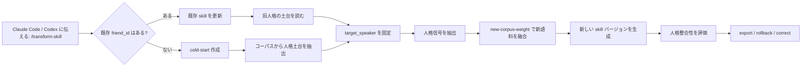

<div align="center">

# transform-skill

> 「蒸留済みの友だちが急に失恋して、性格まで変わった？」<br>
> 「兄弟の口癖がまた増えた。でも中身はまだ同じ人だよね？」<br>
> 「新しいチャットログを反映したい。でも元の人格を吹き飛ばしたくない。」

[中文](./README.md) · [English](./readme_EN.md) · [日本語](./readme_JP.md)

[](https://claude.ai/code)
[](https://openai.com/)
[](#update-first-が標準ルート)
[](#蒸留するのは人格であってチャットログの復読ではありません)

</div>

## これは何か

`transform-skill` は Claude Code / Codex / OpenSkills エコシステム向けの友人ペルソナ skill ワークフローです。

チャットログをそのまま復唱する bot を作るものではありません。コーパスからその人の人格構造を抽出し、新しいコーパスが来たときに人格を安全に進化させます。

標準の仕事はこれです：**既存 skill を更新しつつ、元の人格の土台を守る**。

ゼロからの cold-start 蒸留もできますが、それは任意ルートであり、主役ではありません。

## 蒸留するのは人格であってチャットログの復読ではありません

チャットログには人格にしてはいけないものがたくさんあります。一時的なミーム、その日の気分、グループメンバーの名前、意味のない復唱、文脈の断片、そして冗談に見える宇宙線です。

`transform-skill` が重視するのは安定した信号です：

| 人格レイヤー | 抽出するもの | 避けるもの |
|---|---|---|
| 価値観と境界 | 何を大事にし、何に怒り、どの線を越えられたくないか | 一度の怒り発言を永久ルールにすること |
| 判断スタイル | コスト、リスク、人間関係、行動順をどう見るか | 過去の一回答だけを再生すること |
| 対話アクション | 慰める、ツッコむ、聞き返す、拒否する、前に進めるタイミング | 常にテンプレ助言を返すこと |
| 表現 DNA | 文の長短、口調の強さ、皮肉密度、口癖の使い方 | 口癖を紙吹雪みたいに撒くこと |
| 興味と習慣 | よく話す領域、生活習慣、技術嗜好、社交パターン | キーワードだけで事実を捏造すること |
| 文脈連続性 | 現在の話題と対象話者の立場を保つこと | 他の話者を対象人格に混ぜること |

つまり「原文の次の一文は何か」ではなく、「この人が今ここにいたら、どう考え、どう返し、どう言いそうか」を扱います。

## どんな場面で使うか

| 状況 | transform-skill の処理 |
|---|---|
| 友だちが大きな出来事の後で口調が変わった | 新コーパスで更新しつつ、低から中 weight で元人格を保持 |
| 兄弟の新しい口癖が増えた | 表現変化は吸収しつつ、口癖過多を防ぐ |
| グループチャットに複数人がいる | `target_speaker` で対象を固定 |
| 新コーパスと旧人格が衝突する | 人格コアを守り、`new-corpus-weight` で融合度を調整 |
| 出力がカスタマーサポートっぽくなった | 価値観、判断方式、対話アクションで検査 |
| 更新がズレた | `history` と `rollback` を使う |

## ワークフロー概要



## 1分クイックスタート

### 1. skill をインストール

Claude Code：

```bash
npx skills add Xuan-0929/transform-skill --skill transform-skill -a claude-code -y
```

Codex：

```bash
npx skills add Xuan-0929/transform-skill --skill transform-skill -a codex -y
```

### 2. コーパスのパスを用意

コーパスはどこに置いてもかまいません。Claude Code または Codex が読める場所なら、そのパスを skill に伝えれば動きます。

この構成はおすすめ例です：

```bash
mkdir -p corpus/bootstrap corpus/incoming
```

おすすめ配置：

| 用途 | 推奨パス | 説明 |
|---|---|---|
| ゼロから作成 | `./corpus/bootstrap/<your_seed_corpus>.json` | 最初の安定したコーパス |
| 既存人格を更新 | `./corpus/incoming/<your_new_corpus>.json` | 新しい追加コーパス |
| 複数バッチ | `./corpus/incoming/` | ディレクトリを指定可能 |

JSON ファイル、または JSON を含むディレクトリを扱えます。実際のチャットログは複数人を含むことが多いので、対象話者ラベル、つまり `target_speaker` を確認してください。

### 3. Claude Code での伝え方

既存 skill の更新、つまり標準ルート：

```text
/transform-skill
friend_id=<your_friend_id> を更新してください。
新コーパスは <your_new_corpus_path> にあります。
対象話者は <target_user_label_in_corpus> です。
new-corpus-weight=0.2 にしてください。
```

ゼロから cold-start：

```text
/transform-skill
friend_id=<your_friend_id> を新規作成してください。
コーパスは <your_seed_corpus_path> にあります。
対象話者は <target_user_label_in_corpus> です。
```

履歴確認とロールバック：

```text
/transform-skill
friend_id=<your_friend_id> のバージョン履歴を見せてください。
最新がズレていたら、私が指定するバージョンに戻してください。
```

### 4. Codex での伝え方

slash 入口がない場合は、自然言語で skill 名を指定します：

```text
transform-skill を使って friend_id=<your_friend_id> を更新してください。
新コーパスのパスは <your_new_corpus_path> です。
target_speaker=<target_user_label_in_corpus>。
new-corpus-weight=0.2。
更新後、インストール可能な skill として export してください。
```

## Update-First が標準ルート

標準戦略：**先に人格を守り、その上で新コーパスを吸収する**。

`new-corpus-weight` は、新コーパスにどれだけ発言権を与えるかです：

| Weight | 向いている場面 | 効果 |
|---:|---|---|
| `0.10 - 0.30` | 最近の変化が軽い | 保守的更新、旧人格を強く保持 |
| `0.40 - 0.60` | 明確な最近変化がある | バランス融合 |
| `0.70 - 1.00` | 本当にかなり変わった | 強めに新語料へ適応 |

新しい口癖、興味、近況を少し足したいだけなら `0.2` くらいから始めるのがおすすめです。友だちが本当に魂のパッチを当てた場合だけ高めにしてください。

## グループチャットで話者を混ぜない

実際のチャットログは鍋みたいなものです。誰かが愚痴り、誰かがボケ、誰かがリンクを貼り、誰かが暴走します。

必要なのはこの2つです：

| フィールド | 役割 |
|---|---|
| `friend_id` | あなたがこの人格に付ける安定 ID |
| `target_speaker` | コーパス内の正確な話者ラベル |

例：

```text
friend_id=<your_friend_id>
target_speaker=<exact_speaker_label_in_chat_log>
```

プレースホルダーをそのまま使わないでください。JSON を開き、`speaker`、`sender`、`name`、`nickname` などのフィールドを確認し、対象者の正確な値を指定してください。

## 生成されるもの

成功すると、バージョン管理された人格 skill が生成されます：

| 出力 | 用途 |
|---|---|
| `profile` | 人格コア、表現スタイル、習慣、判断ルール |
| `versions` | create / update ごとの新バージョン |
| `exports.agentskills` | Claude Code / OpenSkills 向け export |
| `exports.codex` | Codex 向け export |
| `history` | バージョン履歴 |
| `rollback` | 更新失敗時の復旧 |
| `correction` | 次回更新のための補正指示 |

## 品質をどう見るか

生成返信が昔のチャットの次の一文と完全一致するかだけを見るのはおすすめしません。それは暗記器になります。

より良い基準は人格整合性です：

| 評価軸 | 見るもの |
|---|---|
| 価値観と立場 | 汎用アシスタント化せず、その人の判断底盤が残っているか |
| 対話アクション | ツッコミ、慰め、質問、拒否、前進が適切か |
| 文脈連続性 | 現在の話題と対象話者の立場を保てているか |
| 自然な表現 | レポートではなく会話に聞こえるか |
| 口癖の節度 | 個性はあるが、口癖を連打しないか |
| 頑健性 | ミーム、汚れたデータ、他人の名前で崩れないか |

内蔵 holdout 評価は人格整合性 judge をサポートしています。正確な文面コピーではなく、「この人ならこう考えて返しそうか」を評価します。

## 普通の prompt テンプレートとの違い

| Prompt テンプレート | transform-skill |
|---|---|
| 人設ルールを手書きする | コーパスから安定人格信号を抽出 |
| すぐアシスタント口調になる | 対話アクションと表現 DNA を保持 |
| 新語料が旧人格を上書きしがち | weight とバージョンで安定更新 |
| グループチャットで話者が混ざる | `target_speaker` で対象を固定 |
| 主に口調を見る | 価値観、判断、文脈連続性も見る |

## よく使う会話コマンド

```text
/transform-skill
friend_id=<friend_id> を更新。corpus=<path>、target_speaker=<target_speaker>、new-corpus-weight=0.2。
```

```text
/transform-skill
friend_id=<friend_id> を作成。corpus=<path>、target_speaker=<target_speaker>。
```

```text
/transform-skill
friend_id=<friend_id> のバージョン履歴を表示。
```

```text
/transform-skill
friend_id=<friend_id> を <version> にロールバック。
```

```text
/transform-skill
friend_id=<friend_id> に補正を追加：口癖を使いすぎず、判断方式と人格コアを優先する。
```

## マルチホスト導入と運用

手動マウント、OpenClaw、ディレクトリ構成、トラブルシューティングは [INSTALL.md](./INSTALL.md) を参照してください。

対応：

- Claude Code への OpenSkills インストール
- Codex への OpenSkills インストール
- Claude Code 手動マウント
- OpenClaw 手動マウント
- ローカル履歴、rollback、export、doctor

## FAQ

### Q1: これはゼロからの蒸留プロジェクトですか？

ゼロからも作れますが、主ルートは既存 skill の更新です。一回きりの錬金釜ではなく、人格のバージョン管理だと考えてください。

### Q2: 口癖だけを学びませんか？

学びません。口癖は表現 DNA の一部にすぎません。価値観、判断スタイル、文脈連続性、対話アクションのほうが優先されます。

### Q3: なぜ原文一致率 100% を目指さないのですか？

過学習になるからです。有用な友人ペルソナは、過去の一文を暗記するのではなく、新しい場面でもその人らしくいる必要があります。

### Q4: `target_speaker` が分からない場合は？

コーパスファイルを開き、対象者の話者フィールドを確認してください。`speaker`、`sender`、`name`、`nickname` などの名前かもしれません。その正確な値を使います。

### Q5: 更新がズレたら？

`history` を見て `rollback` します。その後、より低い `new-corpus-weight` で再更新し、必要なら correction を追加してください。

## 一言で

`transform-skill` は AI に友だちの発言を暗唱させるものではありません。その人がなぜそう考え、どう判断し、関係性をどう扱い、最後にどう言いそうかを skill に覚えさせるものです。
