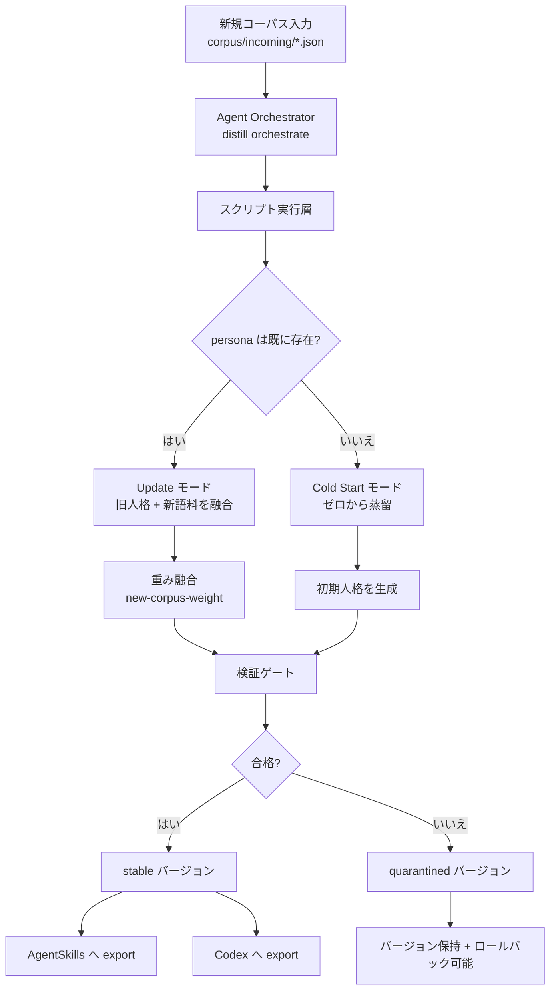

<div align="center">

# transform-skill

> 「蒸留した人格が急に変わった？\
> 新しいコーパスを入れたいけど、既存の個性を壊したくない？」

[中文版](./README.md) · [English](./readme_EN.md) · [日本語](./readme_JP.md)

<br/>

[](https://github.com/Xuan-0929/transform-skill/stargazers)
[](https://github.com/Xuan-0929/transform-skill/commits/main)
[](https://www.python.org/)

[](https://claude.ai/code)
[](https://openai.com/)
[](#update-first戦略)

</div>

---

## OpenSkills ワンクリック導入

インストール可能スキル一覧：

```bash
npx skills add Xuan-0929/transform-skill --list
```

Claude Code 向けインストール：

```bash
npx skills add Xuan-0929/transform-skill \
  --skill distill-from-corpus-path \
  -a claude-code \
  -y
```

Codex 向けインストール：

```bash
npx skills add Xuan-0929/transform-skill \
  --skill distill-from-corpus-path \
  -a codex \
  -y
```

補足：
- ランタイムは `skills/distill-from-corpus-path/runtime` に同梱
- 依存の自動ブートストラップは既定で有効（`DISTILL_AUTO_BOOTSTRAP=0` で無効）
- 蒸留の実行はローカル `claude` CLI を利用（Codex から呼ぶ場合も事前に `claude auth login` が必要）

### OpenSkills 形式への準拠

このリポジトリは「説明だけ」ではなく、実際にインストールできる skill 構成です。

- skill エントリ: `skills/distill-from-corpus-path/SKILL.md`
- 発見可能: `npx skills add <repo> --list` で skill が見える
- ランタイム同梱: `runtime/src/persona_distill` を一緒に配布
- スクリプト自己解決: `DISTILL_PROJECT_ROOT` と skill ローカル runtime の両方に対応

---

## 30秒クイックスタート

OpenSkills 流の使い方です。インストール後は Claude Code / Codex の会話で直接タスクを投げます。
以下の `<...>` はプレースホルダーです。

### 1) 使っている Agent にインストール（初回のみ）

```bash
# Claude Code
npx skills add Xuan-0929/transform-skill --skill distill-from-corpus-path -a claude-code -y

# Codex
npx skills add Xuan-0929/transform-skill --skill distill-from-corpus-path -a codex -y
```

### 2) インストール確認 + ランタイムログイン

```bash
npx skills ls -a claude-code
npx skills ls -a codex
claude auth login
```

### 3) コーパスのパスを準備

```bash
mkdir -p corpus/bootstrap corpus/incoming
```

- `corpus/incoming/<new-corpus-file>.json`: 既存 persona の更新（推奨）
- `corpus/bootstrap/<bootstrap-corpus-file>.json`: 0 からの初回蒸留（任意）

### 4) 会話でそのままタスク指示（推奨）

更新タスク：

```text
distill-from-corpus-path を使って、./corpus/incoming/<new-corpus-file>.json で persona=<your-persona-id> を更新し、new-corpus-weight=0.2、agentskills と codex を両方 export してください。
```

コールドスタート（任意）：

```text
distill-from-corpus-path を使って、./corpus/bootstrap/<bootstrap-corpus-file>.json から persona=<your-persona-id> を初回蒸留し、agentskills と codex を両方 export してください。
```

### 5) 受け入れ確認フィールド

- `workflow_mode`
- `plan.mode`
- `version`
- `status`
- `export.exports.agentskills`
- `export.exports.codex`

---

## コアワークフロー図



---

## Update-First戦略

| `new-corpus-weight` | 適した場面 | 傾向 |
|---|---|---|
| `0.10 - 0.30` | 軽い調整 | 既存人格を強く保持 |
| `0.40 - 0.60` | 通常の更新 | 新旧バランス融合 |
| `0.70 - 1.00` | フェーズ変化 | 新特性を強く反映 |

---

## 出力先

- バージョン skill：`.distill/personas/<persona>/versions/<version>/skill/`
- Agent Skills export：`.distill/personas/<persona>/exports/<version>/agentskills/`
- Codex export：`.distill/personas/<persona>/exports/<version>/codex/`

---

## FAQ

- `Claude CLI is not logged in`
```bash
claude auth login
```

- `Error: claude native binary not installed`
```bash
npm install -g @anthropic-ai/claude-code
node "$(npm root -g)/@anthropic-ai/claude-code/install.cjs"
```

- ランタイムルートが見つからない
```bash
export DISTILL_PROJECT_ROOT=/absolute/path/to/transform-skill
```
