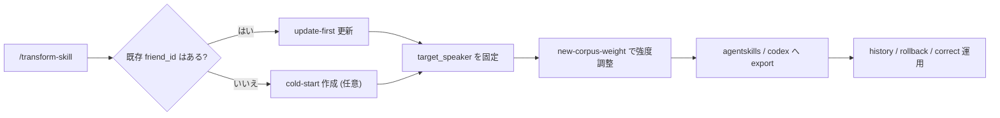

<div align="center">

# transform-skill

> 「友だちの話し方は更新したい。でも元の人格は壊したくない。」  
> 「新しいコーパスを反映したい。でも“別人化”は避けたい。」

[中文](./README.md) · [English](./readme_EN.md) · [日本語](./readme_JP.md)

[](https://claude.ai/code)
[](https://openai.com/)
[](#update-first-が標準ルート)

</div>

## これは何か

`transform-skill` は update-first の skill です。

- 主価値は「ゼロから一発生成」ではありません。
- 主価値は **既存 skill の安定的な進化更新** です。
- 新コーパスを吸収しつつ、既存の人格アンカーを守れます。
- 複数話者コーパスは `target_speaker` で固定可能です。

## できること

1. 既存の友だち人格に新コーパスを追加し、影響度を制御。
2. 履歴確認、ロールバック、エクスポート、補正指示の追加。
3. 必要なときだけコールドスタートで新規作成。

## 典型シナリオ

| 状況 | transform-skill での推奨アクション |
|---|---|
| 口調は少し変わったが、元人格は残したい | `update` + 保守的 weight（`0.2~0.5`） |
| グループチャット由来で話者が多い | `target_speaker` を固定 |
| 最新更新が気に入らない | `history` 確認後 `rollback` |
| Claude/Codex 両方へ配布したい | `export` で `agentskills + codex` |

## 体験フロー



## 1分スタート

### 1) 主入口 skill（`transform-skill`）を導入

```bash
# Claude Code
npx skills add Xuan-0929/transform-skill --skill transform-skill -a claude-code -y

# Codex
npx skills add Xuan-0929/transform-skill --skill transform-skill -a codex -y
```

### 2) コーパス用フォルダを準備

```bash
mkdir -p corpus/bootstrap corpus/incoming
```

- コールドスタート用: `corpus/bootstrap/<seed_corpus>.json`
- 更新用: `corpus/incoming/<new_corpus>.json`

### 3) セッションで起動

Claude Code:

```text
/transform-skill
```

Codex:

```text
transform-skill を使って friend_id=<friend_id> を更新してください。
input=./corpus/incoming/<new_corpus>.json,
target_speaker=<target_speaker>, new-corpus-weight=0.2。
```

## 3つの会話テンプレート

既存 skill の更新（標準）:

```text
/transform-skill
friend_id=friend-alex を更新。
入力は ./corpus/incoming/week4.json、
対象話者は Alex、weight は 0.2。
```

コールドスタート（任意）:

```text
/transform-skill
friend_id=friend-river を新規作成。
入力は ./corpus/bootstrap/seed.json、
対象話者は River。
```

運用（ロールバック例）:

```text
/transform-skill
friend_id=friend-alex の履歴を表示し、
v0003 にロールバック。
```

## Update-First が標準ルート

標準戦略：**先に人格アンカーを守り、その上で新コーパスを反映**。

`new-corpus-weight` の目安：

- `0.10 - 0.30`: 保守的更新、旧人格を強く保持
- `0.40 - 0.60`: バランス更新
- `0.70 - 1.00`: 強い更新

## 複数話者コーパスでの注意

次の2つを固定してください：

1. `friend_id`（同一人物の安定ID）
2. `target_speaker`（コーパス上の正確な話者ラベル）

例：
- `friend_id=friend-alex`
- `target_speaker=Alex`

## プロダクト操作レイヤー

- 既存 skill 更新（標準）
- 新規 cold-start（任意）
- list / history
- rollback / export
- correction
- doctor

実行レイヤーでは `friend-*` セマンティック intent にマッピングされます。

## 結果確認ポイント

成功後は以下を確認：

- `semantic_intent`
- `persona`
- `version`
- `status`
- `workflow_mode`
- `export.exports.agentskills`
- `export.exports.codex`

## 互換性

- 新規利用は `transform-skill` 推奨
- 旧入口 `distill-from-corpus-path` も継続利用可能

## マルチホスト導入・運用

詳細は [INSTALL.md](./INSTALL.md) を参照してください。

対応:
- OpenSkills（Claude Code / Codex）
- Claude Code 手動マウント
- OpenClaw 手動マウント

## FAQ

### Q1: これは一回きりの蒸留ツールですか？

いいえ。中核は **増分更新による人格進化** です。コールドスタートは任意機能です。

### Q2: なぜ `target_speaker` が重要ですか？

実データの会話ログは複数話者が混在しやすく、固定しないとスタイルが混ざるためです。

### Q3: 更新を繰り返すと別人格になりますか？

標準設定ではなりにくいです。`new-corpus-weight` を低めにすれば既存人格をより強く保持できます。
